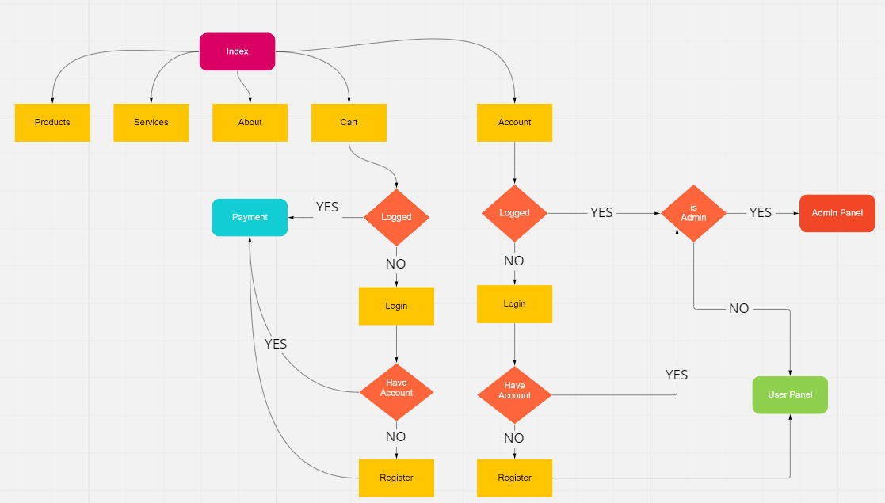

# PetStore
## About

Este é um projeto de uma loja online para a disciplina SCC0219 - Introdução ao Desenvolvimento Web.

#### Members
| Nome | Número USP |
| ------ | ------ |
| João Pedro Rodrigues Freitas | 11316552 |
| Vinícius Santos Monteiro | 11932463 |
| Gabriel Akio Urakawa | 11795912 |
## Project Report

#### Requirements
Neste sistema, teremos 2 tipos de usuários: clientes e administradores:
- Os administradores são responsáveis pelo registro/gerenciamento de administradores, clientes e produtos/serviços fornecidos. O sistema já vem com uma conta admin e com senha admin.
- Clientes são os usuários que têm acesso ao sistema para adquirir produtos/serviços.

O registro do admin contém: nome, id, telefone e usuário.\
O registro de cada cliente contém: nome, id, endereço, telefone, aniversário, email, senha.\
O registro de produtos/serviços contém: nome, id, photo, descrição, preço, quantidade em estoque, quantidade vendida.\
Venda de produtos/serviços: os produtos e serviços são selecionados, as quantidades são escolhidas, e adicionadas ao carrinho. Tais produtos são comprados por meio do cartão de crédito (qualquer número é aceito pelo sistema). A quantidade de produtos/serviços vendidos é subtraída da quantidade em estoque e adicionada a quantidade vendida. Carrinhos são esvaziados apenas após pagamento por parte do cliente.\
Gerenciamento de produtos/serviços: admins podem criar/atualizar/ler/deletar novos produtos e serviços. Por exemplo, eles podem alterar a quantidade em estoque.\
Como funcionalidade extra, nosso sistema reproduzirá o som dos brinquedos dos pets.\
O sistema será responsivo e proverá uma boa acessibilidade e usabilidade.\

#### Project Description
O objetivo deste projeto é criar uma sistema de vendas online de um PetShop com foco em produtos e serviços para animais domésticos.\
A primeira deste projeto foi implementada utilizando-se HTML e CSS.

#### Comments About the Code

#### Test Plan

#### Test Results

#### Build Procedures

#### Problems
Durante a primeira etapa do projeto, as páginas login, register, admin account e user account estão na navbar. Posteriormente, elas serão integradas de acordo com o fato
de o usuário estar logado ou não. Ainda, os produtos e serviços estão estáticos por enquanto, posteriormente serão adicionados automaticamente de acordo com o banco de dados.

#### Comments

## Installation
Abra o index.html na pasta src
