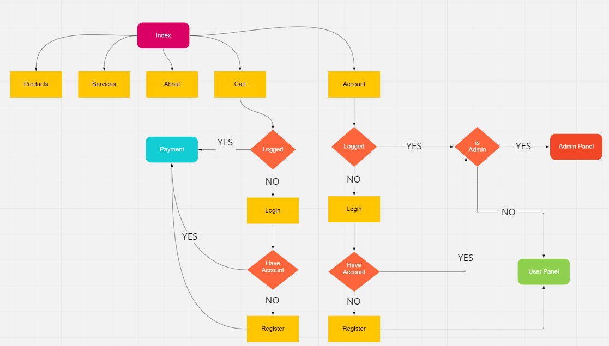

# PetStore
## About

Este é um projeto de uma loja online para a disciplina SCC0219 - Introdução ao Desenvolvimento Web.

#### Members
| Nome | Número USP |
| ------ | ------ |
| João Pedro Rodrigues Freitas | 11316552 |
| Vinícius Santos Monteiro | 11932463 |
| NOME | NUSP |
## Project Report

#### Requirements
The requirements are given in the assignment, but you have to add any new requirements needed by your particular store implementation.
#### Project Description
Describe how your project implements the functionality in the requirements. Diagrams can help a lot here.

#### Comments About the Code
Any comment you may want to add to help understand your code. This is good programming practice.

#### Test Plan

#### Test Results

#### Build Procedures

#### Problems
List any major problems you had.
#### Comments

## Installation
Abra o index.html
